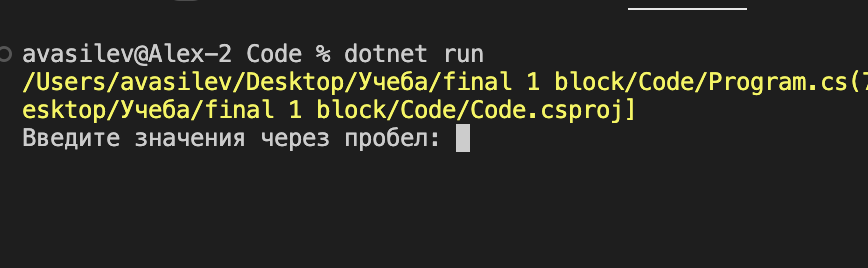
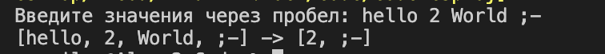

# Итоговая работа. Блок № 1 

## Задание: 
### Написать программу, которая из имеющегося массива строк формирует массив из строк, длина которых меньше либо равна 3 символа. Первоначальный массив можно ввести с клавиатуры, либо задать на старте выполнения алгоритма. При решении не рекомендуется пользоваться коллекциями, лучше обойтись исключительно массивами.

## Алгоритм решения: 

1. Запрашиваем у пользователя данные. Формурем массив. 
2. Делаем перебор массива.
3. Проверяем каждое значения массива на соотвествие заданного параметра. 
4. Если значение соотвествует заданному параметру, включаем его в новый массив.
5. Повторяем **п.3 и п.4**, до того как не закочатся данные массива. 
6. Выводим в консоль: Первоначальный массив и массив сформированный с заданным параметром. 

## Работа с программой:

### Для запуска программы перейдите в папку "code" и выберите файл 

> Program.cs

### В интегированном терминале введите команду: 
> dotnet run 

### Выполняйте команды в терминале. 

## Пример: 
> dotnet run 
> > 

## Вывод результата после ввода: 
> 
